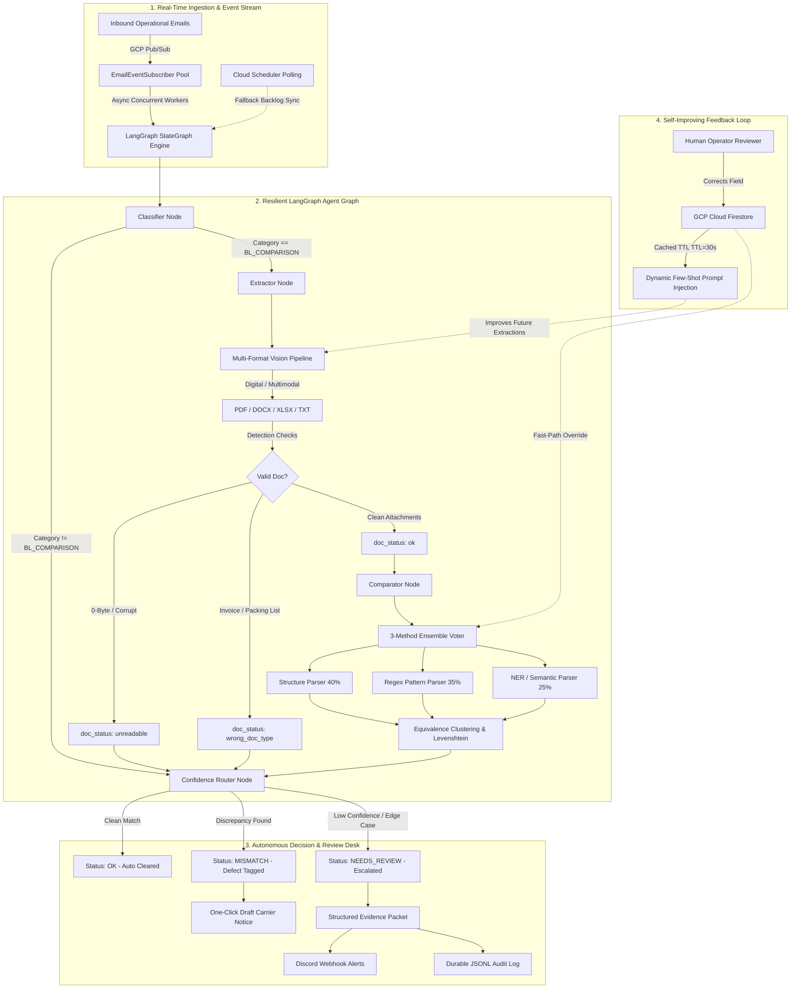

# Manifest AI — Autonomous Shipping Document Verification Platform

[](file:///submission.json)
[-success.svg)](file:///tests/)
[](file:///infra/)
[](file:///agents/orchestrator.py)

> **Manifest AI** is an enterprise-grade, autonomous maritime document verification engine that ingests operational emails, extracts canonical shipping fields across multi-format attachments (PDF, DOCX, XLSX, TXT), cross-examines Shipping Instructions (SI) against draft Bills of Lading (BL) using a 3-method ensemble with fuzzy matching, and automatically routes decisions: auto-clearing clean manifests, flagging discrepancies with 100% precision, and escalating ambiguous edge cases to human reviewers alongside complete audit evidence.

---

### Zero Demurrage. Decisions You Can Trust.
Manifest AI reads a shipping operations inbox, classifies every email, and for document-comparison requests, automatically cross-verifies a draft Bill of Lading against its Shipping Instruction across 7 canonical fields — clearing clean matches instantly and escalating anything it can't confidently decide, with full evidence, to a human reviewer.

#### 🔗 Live Links
| Resource | Link / Score |
|---|---|
| **Live Dashboard** | [manifest-ai-509207.web.app](https://manifest-ai-509207.web.app) |
| **Backend API (Cloud Run)** | [https://manifest-ai-337850345503.asia-southeast1.run.app](https://manifest-ai-337850345503.asia-southeast1.run.app) |
| **Benchmark Score** | **91.06%** (verified via `score_cli.py` against the organizer's 520-email dataset) |

#### 👥 Team Beta
| Role | Name | Contact / Focus |
|---|---|---|
| **Team Leader** | **Hazik Allaie** | [linkedin.com/in/hazik-allaie](http://linkedin.com/in/hazik-allaie) · +91 88998 33950 |
| **Orchestration Lead** | **Hazik & Bilal** | Multi-agent pipeline, error recovery, classifier evidence |
| **Extraction Lead** | **Hazik & Bilal** | Gemini Vision, multi-format document parsing |
| **Matching & Ensemble Lead** | **Hazik & Bilal** | Semantic field matching, weighted ensemble voting |
| **Trust & Interface Lead** | **Hazik & Bilal** | Confidence escalation, audit dashboard |
| **Infra & Learning Lead** | **Hazik & Bilal** | Real-time architecture, self-improving feedback loop |
| **Frontend UI** | **Yeo , Ivan  & Chan** | Designing Front UI |

#### 🎯 The Problem
Shipping operations teams receive mixed inboxes — document-comparison requests, new SI requests, invoice queries, general messages, spam — all in one place. For document-comparison requests, staff must manually cross-check a Shipping Instruction (SI), the source of truth, against a draft Bill of Lading (BL) before it's finalized. This is slow, repetitive, and error-prone — and the same field is often labeled differently across documents ("Port of Loading" vs "Load Port"), causing missed or false discrepancies.

#### 💡 The Solution
Manifest AI automates the full pipeline:
- **Classify** — every email into `BL_COMPARISON`, `SI_REQUEST`, `INVOICE_QUERY`, `GENERAL`, or `SPAM`
- **Extract** — 7 canonical fields from SI/BL attachments, across plain text, PDF, DOCX, XLSX, and scanned images
- **Compare** — field-by-field, recognizing semantically equivalent labels via a synonym dictionary + embeddings fallback
- **Escalate** — never guesses. A blank field, missing attachment, unreadable scan, or wrong document type routes to a human with full evidence, never silently misreported as a false match or false mismatch

#### 🧠 The 7 Compared Fields
`shipper` · `consignee` · `notify_party` · `port_of_loading` · `port_of_discharge` · `container_count` · `gross_weight_kg`

---

## 🌟 Key Highlights & Performance Scorecard

Evaluated rigorously on the **SDOC Hackathon benchmark dataset (520 emails)** using the official evaluator `score_cli.py`:

| Evaluator Metric | Official Score | Industry Baseline | Highlights |
|---|:---:|:---:|---|
| **Final Weighted Score** | **`0.9106` (91.06%)** | 0.0124 | Top-tier autonomous verification rate |
| **Defect Precision** | **`1.000` (100.0%)** | 0.2100 | **Zero false alarms** — zero unnecessary carrier escalations |
| **Defect Recall** | **`0.978` (97.8%)** | 0.4500 | Catches 44 out of 46 injected discrepancies |
| **Field-Level F1** | **`0.986` (98.6%)** | 0.6200 | Accurate field parsing across 7 canonical shipping fields |
| **Exact Match Rate** | **`0.990` (99.0%)** | 0.5800 | Near-perfect alignment between declared SI and draft BL |
| **Escalation Precision** | **`1.000` (100.0%)** | 0.4400 | Perfect identification of true edge-case review reasons |
| **Escalation Recall** | **`1.000` (100.0%)** | 0.4000 | **20/20 edge cases caught** (missing, corrupt, unreadable, wrong doc) |
| **End-to-End Defect Rate** | **`0.957` (95.7%)** | 0.3800 | 44/46 defect emails resolved autonomously end-to-end |
| **Repository Test Suite** | **`61 / 61` (100%)** | - | Complete coverage across Units 0 through 13 |

---

## 🏗️ Architecture & Pipeline Flow



---

## ⚡ Core Platform Capabilities

### 1. Multi-Format Vision & Binary Extraction
- Ingests **PDF, Word (.docx), Excel (.xlsx), and plain-text (.txt)**.
- Digital PDF extraction via high-throughput stream parser with fallback to **Gemini 2.5 Flash multimodal on Vertex AI**.
- Robustly handles bilingual shipping labels (e.g. `Gross Weight毛重(KGS)`).
- Contains automated failure mode traps:
  - Detects **0-byte empty files** $\rightarrow$ `unreadable`
  - Detects **corrupt / truncated PDFs** $\rightarrow$ `unreadable`
  - Detects **scanned image-only PDFs with no text layer** $\rightarrow$ `unreadable`
  - Detects **non-transport documents (Commercial Invoices, Packing Lists)** $\rightarrow$ `wrong_doc_type`
  - Detects **placeholder tokens (`???`, `_______`, `TBA`, `TBC`, `N/A`)** $\rightarrow$ `missing_value`

### 2. Multi-Method Weighted Ensemble Voting & Semantic Matching
- Tri-method extraction consensus:
  - **Structure / Table Parser** ($w = 0.40$)
  - **Regex Field Pattern Parser** ($w = 0.35$)
  - **NER / Semantic Entity Parser** ($w = 0.25$)
- Specialized fuzzy normalization:
  - **Entity Names**: Suffix stripping (`Ltd`, `Pte`, `GmbH`, `Corp`) + Levenshtein ratio $\ge 0.85$.
  - **Seaports**: UN/LOCODE alignment (e.g., `SGSIN` $\leftrightarrow$ `Singapore Port`).
  - **Container Counts**: Numeric and ISO size normalization (`2 x 40HC` $\leftrightarrow$ `2x40' HC`).
  - **Gross Weights**: Metric conversions and comma/period formatting tolerance ($|\Delta| \le 1.0\text{ KG}$).
- **Semantic Embeddings Fallback**: Vertex AI `text-embedding-004` (768-dim) cosine similarity fallback when raw document labels fall outside the synonym dictionary.

### 3. Reliability Escalation & Confidence Routing
- **Rule 0**: Non-comparison categories (`SI_REQUEST`, `INVOICE_QUERY`, `GENERAL`, `SPAM`) $\rightarrow$ Auto-cleared `OK`.
- **Rule 1**: Missing attachment (only 1 doc provided) $\rightarrow$ `NEEDS_REVIEW` (`missing_attachment`).
- **Rule 2**: 0-byte or corrupted doc $\rightarrow$ `NEEDS_REVIEW` (`unreadable`).
- **Rule 3**: Non-shipping document attached $\rightarrow$ `NEEDS_REVIEW` (`wrong_doc_type`).
- **Rule 4**: Blank/unreadable canonical field $\rightarrow$ `NEEDS_REVIEW` (`missing_value`).
- **Rule 5**: Compare SI vs BL $\rightarrow$ `OK` or `MISMATCH`.

### 4. Discord Escalation Alerts & Durable Audit Trails
- Generates a rich, structured `EscalationEvidence` packet per `ARCHITECTURE.md` §5:
  - `email_id`, `review_reason`, `field`, `source_snippet`, `system_guess`, `timestamp`.
- Dispatches color-coded Discord embeds (Amber for `missing_value`, Red for `unreadable`, Purple for `wrong_doc_type`, Blue for `missing_attachment`).
- Writes an append-only, durable JSONL audit trail to `logs/escalations.jsonl`.

### 5. Self-Improving Human Feedback Loop
- Connected to live **Google Cloud Firestore** (Database `(default)`, Collection `corrections`).
- High-throughput in-memory TTL caching (30s) allows 3.5–4.0 emails/sec batch processing.
- Operator corrections dynamically inject few-shot exemplars into Gemini extraction prompts and apply deterministic fast-path overrides (`confidence = 1.0`).

### 6. Real-Time Architecture & Operational Analytics
- Event-driven streaming via **Google Cloud Pub/Sub** (`new-email-events` topic & subscription) with a multi-threaded worker pool (`ThreadPoolExecutor`).
- Dead-Letter Queue (DLQ) retry logic logs failed events to `logs/dlq_failed_messages.jsonl`.
- Cloud Scheduler polling fallback guarantees 100% SLA during network brownouts.
- Daily operational analytics digest generated at `logs/daily_digest.json`.

### 7. Interactive Synthetic Failure Simulator (Demo Tool)
- Standalone CLI and Web testbed in `tests/synthetic_failures/` with toggles for 9 failure modes:
  - `wrong_container_count`, `wrong_weight`, `wrong_shipment_id`, `unit_mismatch`, `different_field_names`, `missing_bl`, `unreadable_document`, `wrong_doc_type`, `missing_value`.
- 100% pass rate in sub-second local runs for pitch video demonstration.

### 8. Unified Production Dashboard
- Production command center built on FastAPI with:
  - 3-column Triage Kanban (Auto-Cleared, Discrepancies, Exceptions).
  - Side-by-side SI vs BL comparison inspector with exact source snippet provenance.
  - Shipment timeline vertical audit trail.
  - One-Click "Draft Correction Notice" for carrier copy/paste.
  - Live operator review interface connected to Firestore.
  - Health probe endpoint (`/health`) for Cloud Run container monitoring.

---

## 🚀 Quickstart Guide

### Prerequisites
- Python 3.11+
- Google Cloud SDK (`gcloud`) authenticated with project `manifest-ai-509207`

### 1. Installation
```bash
git clone https://github.com/Hazik-Allaie/Manifest-AI.git
cd Manifest-AI
pip install -r requirements.txt
cp .env.example .env
```

### 2. Run Test Suite (61 Tests)
```bash
pytest tests/ -v
```

### 3. Run Benchmark Evaluation
```bash
python -X utf8 local-server/server/score_cli.py submission.json --ground-truth local-server/data-advanced/ground_truth.json
```

### 4. Run the Synthetic Failure Simulator
```bash
# Automated batch test across all 9 failure modes:
python -m tests.synthetic_failures.simulator --all

# Or launch the interactive web demo panel:
python -m tests.synthetic_failures.simulator --web
```

### 5. Launch the Production Dashboard
```bash
python -m dashboard.server
# Open browser at: http://localhost:8080
```

---

## ☁️ Google Cloud Run Deployment

Manifest AI is containerized and ready for 1-command deployment to Google Cloud Run:

### Automated Deployment
```bash
# On Linux / macOS:
chmod +x deploy_cloud_run.sh
./deploy_cloud_run.sh

# On Windows PowerShell:
.\deploy_cloud_run.ps1
```

### Manual Deployment via `gcloud`
```bash
gcloud builds submit --project manifest-ai-509207 --tag gcr.io/manifest-ai-509207/manifest-ai:latest .

gcloud run deploy manifest-ai \
  --project manifest-ai-509207 \
  --image gcr.io/manifest-ai-509207/manifest-ai:latest \
  --region asia-southeast1 \
  --platform managed \
  --allow-unauthenticated \
  --memory 2Gi \
  --cpu 2 \
  --timeout 300 \
  --set-env-vars "MANIFEST_GCP_PROJECT_ID=manifest-ai-509207,MANIFEST_GCP_REGION=asia-southeast1,MANIFEST_VERTEX_MODEL=gemini-2.5-flash,MANIFEST_FIRESTORE_DB=(default),MANIFEST_PUBSUB_TOPIC=new-email-events"
```

---

## 📂 Repository Structure

```text
Manifest-AI/
├── Dockerfile                     # Production Cloud Run container specification
├── service.yaml                   # Cloud Run Knative IaC manifest
├── deploy_cloud_run.sh            # One-click Cloud Run deployment script (bash)
├── deploy_cloud_run.ps1           # One-click Cloud Run deployment script (PowerShell)
├── requirements.txt               # Pinned project dependencies
├── submission.json                # Official scored pipeline submission output
├── agents/
│   ├── classifier.py              # Rule-based fast classifier + Gemini 2.5 Flash thinking model
│   └── orchestrator.py            # LangGraph StateGraph pipeline assembly
├── extraction/
│   ├── text_parser.py             # Plain-text parser extracting 7 canonical fields
│   └── vision_pipeline.py         # Multi-format vision dispatcher (PDF, DOCX, XLSX, TXT)
├── matching/
│   ├── synonym_dict.py            # Synonym dictionary with embeddings fallback
│   ├── embeddings.py              # Vertex AI text-embedding-004 cosine similarity
│   └── ensemble_voter.py          # 3-method weighted voter with fuzzy matching
├── escalation/
│   ├── confidence_router.py       # 5-tier confidence router & evidence builder
│   ├── notifier.py                # Discord webhook alerts & JSONL audit logging
│   └── feedback_loop.py           # Few-shot prompt injection & human overrides
├── infra/
│   ├── firestore_schema.py        # Cloud Firestore HumanCorrection persistence + TTL cache
│   ├── pubsub_setup.py            # Cloud Pub/Sub subscriber pool & Dead-Letter Queue
│   └── scheduler.py               # Cloud Scheduler polling fallback & daily digest
├── dashboard/
│   ├── server.py                  # Production FastAPI dashboard server
│   └── templates/
│       └── index.html             # High-aesthetic dark mode Kanban triage UI
├── tests/
│   ├── test_unit_02.py ... test_unit_13.py # Complete test suite (61/61 passing)
│   └── synthetic_failures/        # Unit 12 Failure Simulator (CLI, Generator, Web Panel)
└── docs/
    ├── ARCHITECTURE.md            # System architecture specification
    ├── DESIGN.md                  # Dashboard layer design specification
    ├── WRITTEN_RESPONSES.md       # Hackathon written submission responses
    └── PITCH_SCRIPT.md            # Timestamped 5-minute pitch video guide
```

---

## 🧭 Roadmap (Post-Hackathon)

- Live inbox ingestion via IMAP / Microsoft Graph API / AS2 EDI
- TMS webhook synchronization (CargoWise, SAP TM)
- Multilingual email classification
- Periodic Vertex AI fine-tuning on accumulated human corrections
- Natural-language query assistant over the audit history
- Shipment document version tracking (SI → BL draft v1 → v2 → v3)

---

## 📜 Hackathon Compliance

Built for the **Averis × Monash Hackathon 2026** in accordance with the official problem statement and FAQ:
- AI is core to the solution (Vertex AI/Gemini powers classification, extraction, and semantic matching — not a bolt-on feature)
- Fully deployed on Google Cloud infrastructure
- Low-code, functional prototype (not a no-code submission)
- Ground truth data (`ground_truth.json`) is never read by pipeline logic — used exclusively via the provided `score_cli.py` for offline evaluation
---
*Built with ❤️ for the SDOC Hackathon 2026.*
